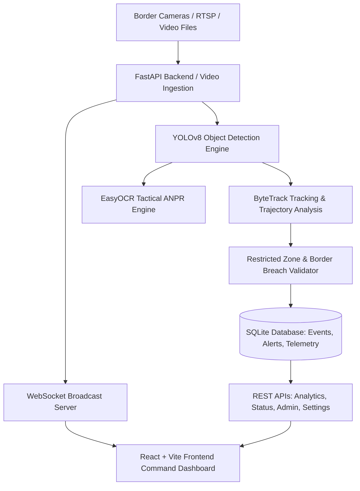

# 🛡️ IBVAP - Intelligent Border Video Analysis Platform

[](https://github.com)
[](https://fastapi.tiangolo.com)
[](https://reactjs.org)
[](https://ultralytics.com)
[]()

> **IBVAP (Intelligent Border Video Analysis Platform)** is a high-availability, AI-powered border surveillance and command-center analytics system designed for defense and paramilitary border outposts. It provides real-time multi-camera video analysis, automated threat detection, license plate recognition (ANPR), and operational intelligence synchronization.

---

## 📸 Key Capabilities & System Features

### 1. 🎥 Live Video Surveillance & AI Detection Pipeline
- **Multi-Camera Feeds**: Simultaneous monitoring and processing of fixed border posts, thermal cameras, and PTZ stations.
- **YOLOv8 Inference**: Real-time identification of unauthorized personnel, vehicles, and wildlife movements along restricted border fences.
- **ByteTrack Multi-Object Tracking**: Trajectory tracking with speed estimation, dwell time calculation, and restricted zone intrusion warnings.
- **MJPEG Streaming & WebSocket Telemetry**: Sub-50ms live stream broadcasting with synchronized bounding box telemetry.

### 2. 🚨 Tactical Events & Alerts Dashboard
- **5 KPI Summary Cards**: Total Alerts, High Severity, Medium Severity, Low Severity, and Resolved alerts with weekly trend comparisons.
- **Analytics Visualizations**:
  - Multi-series smoothed Bézier trend area charts.
  - Alert classification SVG donut charts.
  - Sector-wise alert distribution bar charts.
- **Operational Action Controls**: Direct database write actions (`Acknowledge`, `Escalate`, `Mark as Resolved`) with automated audit trails.
- **Interactive Evidence Player**: Embedded detection bounding box overlays, playback scrubbers, and quick links to Video Library and Border Map.

### 3. 🚗 Tactical Vehicle ANPR (Automatic Number Plate Recognition)
- **High-Accuracy Plate Extraction**: High-speed OCR with character segmentation tailored for standard high-security registration plates (HSRP).
- **Indian State Code Decoding**: Automatic state identification (`DL`, `JK`, `PB`, `HR`, `RJ`, etc.).
- **Suspect Hotlist / Watchlist**: Real-time cross-referencing against flagged vehicles with instant sound alerts.
- **Export & Filtering**: Real-time search, camera filters, state filters, and 1-click CSV audit logging export.

### 4. 📊 Command Center Analytics & Heatmaps
- **Dynamic Metrics**: 100% computed from active surveillance records in SQLite.
- **Perimeter Activity Heatmaps**: Geographic radar layout plotting detection hotspots per station.
- **Time-Series Analysis**: Flexible window filtering (`Today`, `Last 24 Hours`, `Last 7 Days`, `Last 30 Days`).
- **Clean Reset Synchronization**: When storage or data is purged, all analytics counters cleanly reset to baseline.

### 5. ⚡ Real-Time System Status & Hardware Telemetry
- **Hardware Telemetry**: Real-time CPU, RAM, and Disk metrics via `psutil` with radial SVG gauges and 1-hour CPU history area curves.
- **8 Core Services Health**: Real-time monitoring of Video Ingestion, AI Detection, Tracking Engine, WebSocket Server, API Server, Database, Alert Engine, and Storage Manager.
- **Operational Quick Actions**:
  - `Restart AI Service`: Re-initializes YOLOv8 weights and resets tracking states.
  - `Clear Logs`: Purges non-critical diagnostic logs while preserving audit integrity.
  - `Reboot System`: Simulates command-grade restart with health check confirmation.
  - `Backup Database`: Creates timestamped backups and provides immediate file download.
  - `Test Camera Feeds`: Pings camera stations and computes latency matrices.
  - `Check Updates`: Validates module checksums against stable release branches.

### 6. 👤 Personnel Administration & Access Control (RBAC)
- **Role Clearances**: Granular clearance levels from `Tactical Operator` to `Base Administrator`.
- **Operator Roster Ledger**: Duty status, terminal assignment, assigned BOP sector, and primary camera feeds.
- **Account Management**: Create and delete operator accounts with military-standard credential verification.
- **Workstation Security**: 1-click terminal lock screen with PIN/password unlocking.

### 7. 🎨 Aesthetics & Localization
- **Tactical Dark & Light Modes**: Curated HSL color palette with high-contrast military HUD styling.
- **Multi-Language Support**: Complete interface localization in English, Hindi (हिन्दी), Punjabi (ਪੰਜਾਬੀ), and Bengali (বাংলা).
- **Universal Back Navigation**: Prominent `← Back` buttons on all modal dialogues to ensure zero operator entrapment.

---

## 🛠️ Architecture & Tech Stack



| Layer | Technologies |
|---|---|
| **Frontend** | React 18, Vite 5, Vanilla CSS Design System, Lucide React Icons |
| **Backend** | Python 3.11+, FastAPI, Uvicorn, SQLAlchemy ORM, Pydantic v2 |
| **Database** | SQLite (surveillance.db) with atomic transactions |
| **Computer Vision** | OpenCV, Ultralytics YOLOv8, ByteTrack, EasyOCR |
| **Telemetry** | `psutil` real-time hardware telemetry, WebSockets |

---

## 🚀 Quick Start & Installation

### Prerequisites
- **Node.js** (v18.0 or higher) & **npm**
- **Python** (v3.10, v3.11, or v3.12)
- **Git**

### 1. Clone the Repository
```bash
git clone https://github.com/YOUR_USERNAME/IBVAP.git
cd IBVAP
```

### 2. Automated 1-Click Startup (Windows)
Double-click `start.bat` or run:
```cmd
start.bat
```
This automatically initializes the Python virtual environment, installs requirements, sets up Node modules, and boots both servers simultaneously.

### 3. Manual Step-by-Step Setup

#### Backend Setup
```bash
cd backend
python -m venv venv
# Windows:
venv\Scripts\activate
# Linux/macOS:
source venv/bin/activate

pip install -r requirements.txt
python -m uvicorn app.main:app --port 8000 --reload
```

#### Frontend Setup
```bash
# In the project root directory
npm install
npm run dev
```

Open your browser at **`http://localhost:5173`** to access the dashboard.
Backend API documentation is available at **`http://localhost:8000/docs`**.

---

## 📁 Repository Structure

```
IBVAP_FINAL_PROJECT/
├── backend/
│   ├── app/
│   │   ├── ai/               # YOLOv8 pipeline, ByteTrack tracker, ANPR engine
│   │   ├── models.py         # SQLAlchemy ORM models (Camera, Event, Alert, Plate, etc.)
│   │   ├── schemas.py        # Pydantic data validation schemas
│   │   ├── database.py       # DB engine and session handling
│   │   ├── main.py           # FastAPI entrypoint, middleware, static mounts
│   │   ├── routers/          # Modular API endpoints (events, anpr, analytics, etc.)
│   │   └── services/         # Background tasks, audit logging, telemetry
│   ├── storage/              # Local surveillance database, videos, and evidence
│   └── requirements.txt      # Python dependencies
├── src/
│   ├── components/           # Common components (Header, Sidebar, Modals, SystemStatus)
│   ├── pages/                # Command views:
│   │   ├── LiveMonitor/      # Video Surveillance & Multi-camera layout
│   │   ├── EventsAlerts/     # Tactical Events & Alerts Dashboard
│   │   ├── VehicleANPR/      # License Plate Recognition & Watchlists
│   │   ├── Analytics/        # Strategic Command Intelligence & Heatmaps
│   │   ├── CameraManagement/ # Camera registration and status
│   │   ├── SystemStatus/     # Hardware telemetry and 6 Quick Actions
│   │   └── Settings/         # Operational tuning, Purge/Reset, Operators
│   ├── services/             # Settings, Operator auth, i18n, WebSockets
│   ├── index.css             # Unified command-center design system
│   └── App.jsx               # Application root
├── public/                   # Static assets, badges, evidence snapshots
├── start.bat                 # 1-click startup batch script
└── vite.config.js            # Vite build configuration with /api proxy
```

---

## 🔒 Security & Data Integrity

- **Destructive Action Guards**: Resetting operational data requires explicit typing of `"RESET IBVAP"`.
- **Audit Trails**: All operational modifications (operator logins, account creation/deletion, alert escalation, rule tuning) are permanently recorded in the system audit ledger.
- **Zero Phantom Records**: Purge actions wipe records cleanly across all telemetry and analytics stores simultaneously.

---

## 📜 License
Developed for the Smart India Hackathon (SIH) Border Security Challenge.
Distributed under the MIT License. See `LICENSE` for more information.
